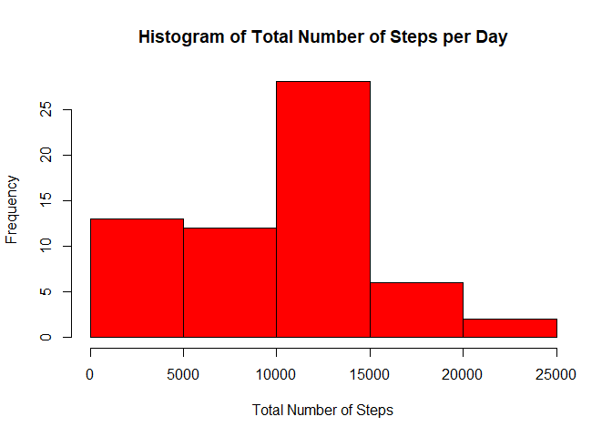
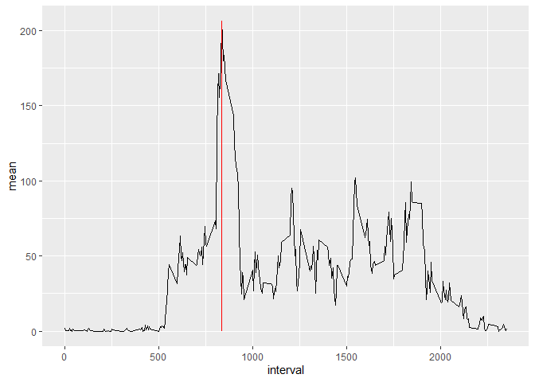
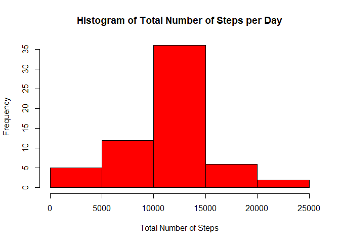
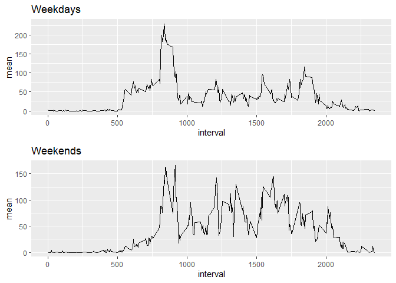

## Loading and preprocessing the data


```r
        data <- read.csv("activity.csv")
        head(data)
```

```
##   steps       date interval
## 1    NA 2012-10-01        0
## 2    NA 2012-10-01        5
## 3    NA 2012-10-01       10
## 4    NA 2012-10-01       15
## 5    NA 2012-10-01       20
## 6    NA 2012-10-01       25
```


## What is mean total number of steps taken per day?


```r
        library(dplyr)
        mean_steps <- data %>% group_by(date) %>% 
                summarise(sum = sum(steps, na.rm= TRUE), mean = mean(steps, na.rm= TRUE))
        print(mean_steps, n = 62)
```

```
## # A tibble: 61 x 3
##    date         sum    mean
##    <chr>      <int>   <dbl>
##  1 2012-10-01     0 NaN    
##  2 2012-10-02   126   0.438
##  3 2012-10-03 11352  39.4  
##  4 2012-10-04 12116  42.1  
##  5 2012-10-05 13294  46.2  
##  6 2012-10-06 15420  53.5  
##  7 2012-10-07 11015  38.2  
##  8 2012-10-08     0 NaN    
##  9 2012-10-09 12811  44.5  
## 10 2012-10-10  9900  34.4  
## 11 2012-10-11 10304  35.8  
## 12 2012-10-12 17382  60.4  
## 13 2012-10-13 12426  43.1  
## 14 2012-10-14 15098  52.4  
## 15 2012-10-15 10139  35.2  
## 16 2012-10-16 15084  52.4  
## 17 2012-10-17 13452  46.7  
## 18 2012-10-18 10056  34.9  
## 19 2012-10-19 11829  41.1  
## 20 2012-10-20 10395  36.1  
## 21 2012-10-21  8821  30.6  
## 22 2012-10-22 13460  46.7  
## 23 2012-10-23  8918  31.0  
## 24 2012-10-24  8355  29.0  
## 25 2012-10-25  2492   8.65 
## 26 2012-10-26  6778  23.5  
## 27 2012-10-27 10119  35.1  
## 28 2012-10-28 11458  39.8  
## 29 2012-10-29  5018  17.4  
## 30 2012-10-30  9819  34.1  
## 31 2012-10-31 15414  53.5  
## 32 2012-11-01     0 NaN    
## 33 2012-11-02 10600  36.8  
## 34 2012-11-03 10571  36.7  
## 35 2012-11-04     0 NaN    
## 36 2012-11-05 10439  36.2  
## 37 2012-11-06  8334  28.9  
## 38 2012-11-07 12883  44.7  
## 39 2012-11-08  3219  11.2  
## 40 2012-11-09     0 NaN    
## 41 2012-11-10     0 NaN    
## 42 2012-11-11 12608  43.8  
## 43 2012-11-12 10765  37.4  
## 44 2012-11-13  7336  25.5  
## 45 2012-11-14     0 NaN    
## 46 2012-11-15    41   0.142
## 47 2012-11-16  5441  18.9  
## 48 2012-11-17 14339  49.8  
## 49 2012-11-18 15110  52.5  
## 50 2012-11-19  8841  30.7  
## 51 2012-11-20  4472  15.5  
## 52 2012-11-21 12787  44.4  
## 53 2012-11-22 20427  70.9  
## 54 2012-11-23 21194  73.6  
## 55 2012-11-24 14478  50.3  
## 56 2012-11-25 11834  41.1  
## 57 2012-11-26 11162  38.8  
## 58 2012-11-27 13646  47.4  
## 59 2012-11-28 10183  35.4  
## 60 2012-11-29  7047  24.5  
## 61 2012-11-30     0 NaN
```

```r
        hist(mean_steps$sum, col = 'red', xlab = 'Total Number of Steps', 
             main = 'Histogram of Total Number of Steps per Day' )
```

<!-- -->

## What is the average daily activity pattern?


```r
        daily_pattern <- data %>% group_by(interval) %>%
        summarise(mean = mean(steps, na.rm = TRUE))
```

```
## `summarise()` ungrouping output (override with `.groups` argument)
```

```r
        library(ggplot2)
        daily_pattern %>% ggplot(aes(interval, mean))+
                geom_line()+
                geom_segment(aes(x = daily_pattern$interval[which.max(daily_pattern$mean)], 
                                 xend = daily_pattern$interval[which.max(daily_pattern$mean)], 
                                 y=0, 
                                 yend=max(daily_pattern$mean)), 
                             col = 'red')
```

<!-- -->

## Imputing missing values


```r
sum(is.na(data))
```

```
## [1] 2304
```

```r
print(data %>% group_by(date) %>% summarise(sum = sum(is.na(steps))), n=62)
```

```
## # A tibble: 61 x 2
##    date         sum
##    <chr>      <int>
##  1 2012-10-01   288
##  2 2012-10-02     0
##  3 2012-10-03     0
##  4 2012-10-04     0
##  5 2012-10-05     0
##  6 2012-10-06     0
##  7 2012-10-07     0
##  8 2012-10-08   288
##  9 2012-10-09     0
## 10 2012-10-10     0
## 11 2012-10-11     0
## 12 2012-10-12     0
## 13 2012-10-13     0
## 14 2012-10-14     0
## 15 2012-10-15     0
## 16 2012-10-16     0
## 17 2012-10-17     0
## 18 2012-10-18     0
## 19 2012-10-19     0
## 20 2012-10-20     0
## 21 2012-10-21     0
## 22 2012-10-22     0
## 23 2012-10-23     0
## 24 2012-10-24     0
## 25 2012-10-25     0
## 26 2012-10-26     0
## 27 2012-10-27     0
## 28 2012-10-28     0
## 29 2012-10-29     0
## 30 2012-10-30     0
## 31 2012-10-31     0
## 32 2012-11-01   288
## 33 2012-11-02     0
## 34 2012-11-03     0
## 35 2012-11-04   288
## 36 2012-11-05     0
## 37 2012-11-06     0
## 38 2012-11-07     0
## 39 2012-11-08     0
## 40 2012-11-09   288
## 41 2012-11-10   288
## 42 2012-11-11     0
## 43 2012-11-12     0
## 44 2012-11-13     0
## 45 2012-11-14   288
## 46 2012-11-15     0
## 47 2012-11-16     0
## 48 2012-11-17     0
## 49 2012-11-18     0
## 50 2012-11-19     0
## 51 2012-11-20     0
## 52 2012-11-21     0
## 53 2012-11-22     0
## 54 2012-11-23     0
## 55 2012-11-24     0
## 56 2012-11-25     0
## 57 2012-11-26     0
## 58 2012-11-27     0
## 59 2012-11-28     0
## 60 2012-11-29     0
## 61 2012-11-30   288
```


To impute these NA values we'll be use mean values of 5min intervals


```r
        tidy <- data
        tidy <- left_join(tidy, daily_pattern, by = 'interval') %>%
        mutate(steps = ifelse(is.na(steps), mean, steps)) %>% 
                select(steps, date, interval)
```


```r
        tidy_sum <- tidy %>% group_by(date) %>% summarise(sum = sum(steps))
        hist(tidy_sum$sum, col = 'red', xlab = 'Total Number of Steps', 
             main = 'Histogram of Total Number of Steps per Day')
```

<!-- -->

Summary of Total Number of Steps per Day with without imputation;


```r
        data %>% group_by(date) %>% mutate(sum = sum(steps)) %>% 
        select(sum) %>% summary()
```

```
##      date                sum       
##  Length:17568       Min.   :   41  
##  Class :character   1st Qu.: 8841  
##  Mode  :character   Median :10765  
##                     Mean   :10766  
##                     3rd Qu.:13294  
##                     Max.   :21194  
##                     NA's   :2304
```
Summary of Total Number of Steps per Day with imputation;


```r
        tidy_sum %>% summary()
```

```
##      date                sum       
##  Length:61          Min.   :   41  
##  Class :character   1st Qu.: 9819  
##  Mode  :character   Median :10766  
##                     Mean   :10766  
##                     3rd Qu.:12811  
##                     Max.   :21194
```

As seen in summaries there are no impact of imputation on the data. But getting rid of NA's is healthy way of running analyses.

## Are there differences in activity patterns between weekdays and weekends?

First of all date column must be converted date format to character format;


```r
        tidy$date <- as.Date(tidy$date, "%Y-%m-%d")
```

Then add days column to data set;


```r
        tidy <- tidy %>% mutate (days = weekdays(date))
```

Turn days column to factor column with respect to weekdays or weekends;


```r
        tidy$days <- factor(tidy$days, levels = c("Monday", "Tuesday", "Wednesday", "Thursday", "Friday", "Saturday", "Sunday"), labels = c("Weekday", "Weekday", "Weekday", "Weekday", "Weekday", "Weekend", "Weekend"))
```


```r
        library(gridExtra)

        graph_1 <- tidy %>% filter(days == "Weekday") %>% group_by(interval) %>% 
                summarise(mean = mean(steps)) %>% 
                ggplot(aes(interval, mean))+
                geom_line()+
                ggtitle("Weekdays")
                

        graph_2 <- tidy %>% filter(days == "Weekend") %>% group_by(interval) %>% 
                summarise(mean = mean(steps)) %>%
                ggplot(aes(interval, mean))+
                geom_line()+
                ggtitle("Weekends")
        
        grid.arrange(graph_1, graph_2, nrow = 2)
```

<!-- -->


